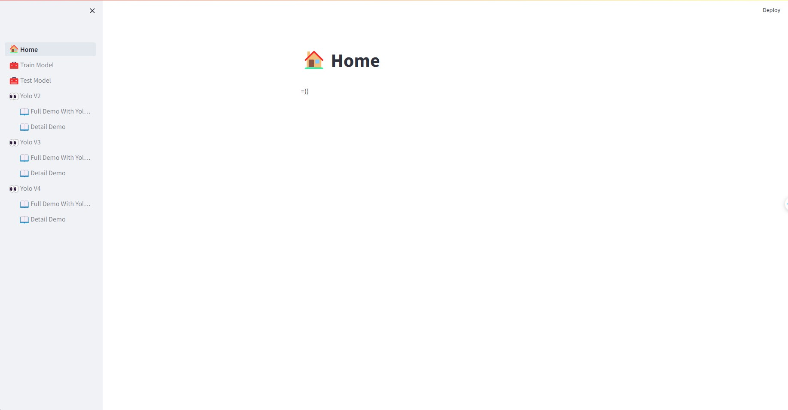
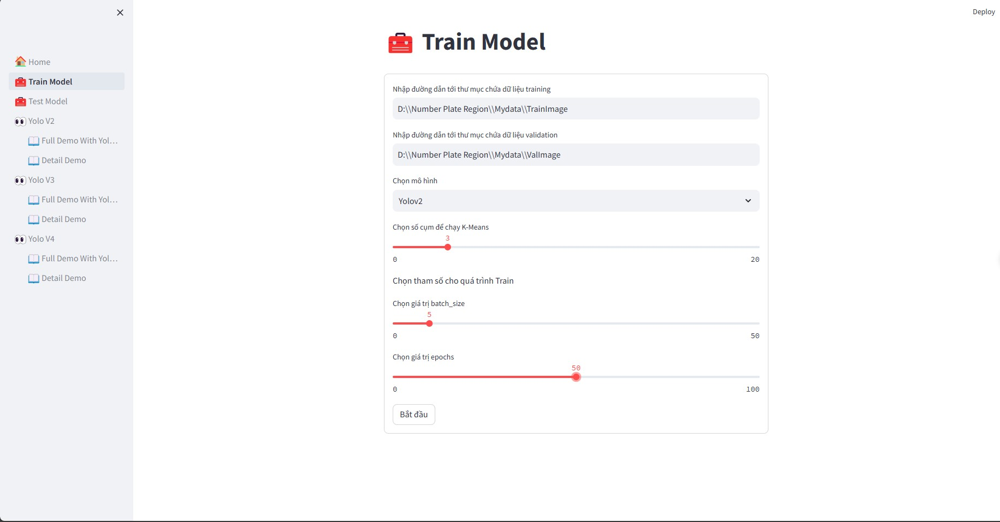
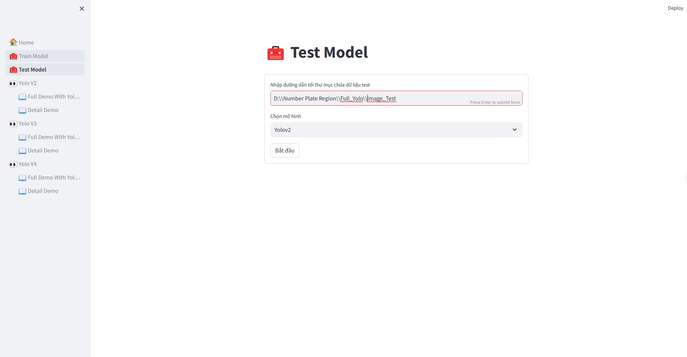
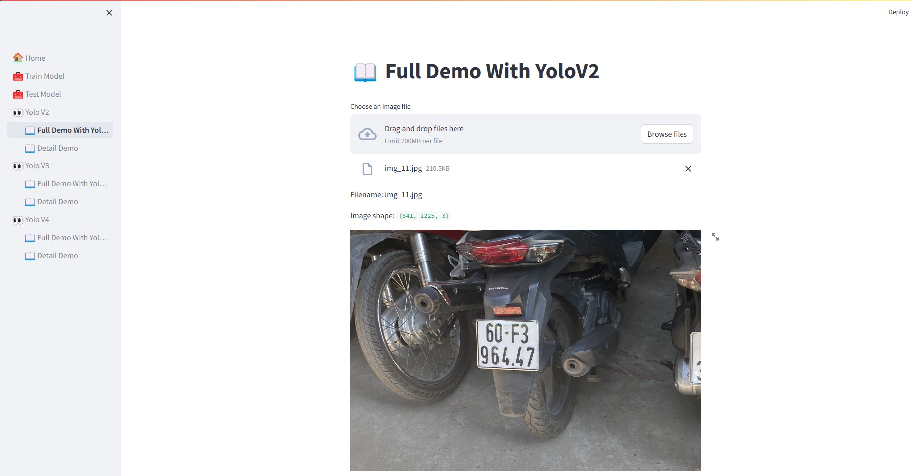
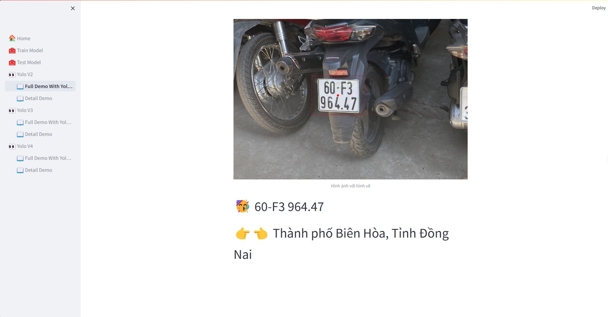

## :wrench: Dependencies and Installation

- Python 3.10

### Installation

1. Clone repo

    ```bash
    git clone https://github.com/LeMinhDang2002/Demo_Yolo_2_4.git
    cd Demo_Yolo_2_4
    ```
2. Create ENV
    ```bash
    C:\Users\Tên Máy\AppData\Local\Programs\Python\Python310\python.exe -m venv env
    .\env\Scripts\Activate.ps1
    ```

3. Clone GFPGAN
    ```bash
    git clone https://github.com/TencentARC/GFPGAN.git
    ```
    ```bash
    cd .\GFPGAN

    pip install basicsr

    pip install facexlib

    python setup.py develop

    pip install -r requirements.txt

    ```
4. Install dependent packages
    ```bash
    cd ..
    pip install -r requirements.txt
    ```
5. In file .\DEMO_YOLO_2_4\env\lib\site-packages\basicsr\data\degradations.py
    ```bash
    Change
    from torchvision.transforms.functional_tensor import rgb_to_grayscale
    to
    from torchvision.transforms.functional import rgb_to_grayscale
    ```

6. Download weights
    1. Download all file weight on [Google Drive](https://drive.google.com/drive/u/0/folders/107Mbd57HGSR5UPSTwB4yCKrMrJfbn-ri)
    2. Create Weight folder in Demo_Yolo_2_4 folder
    3. Save file yolov2_3_anchor.h5, yolov3_3_anchor.h5, yolov4_3_anchor.h5, cnn_epochs_6.h5 in the Weights folder

7. Download Image
    1. Download images [Google Drive](https://drive.google.com/drive/u/0/folders/1FdTowwdpC7T-9KiS_Edi-DK1Ch90R144)

8. Run code
    ```bash
    streamlit run home.py
    ```
---
### :book: Instruction

1. Home page

<p align="center">
  
</p>

2. Train Page

<p align="center">
  
</p>

3. Test Page

<p align="center">
  
</p>

4. Prediction Page

<p align="center">
  
</p>
---
<p align="center">
  
</p>